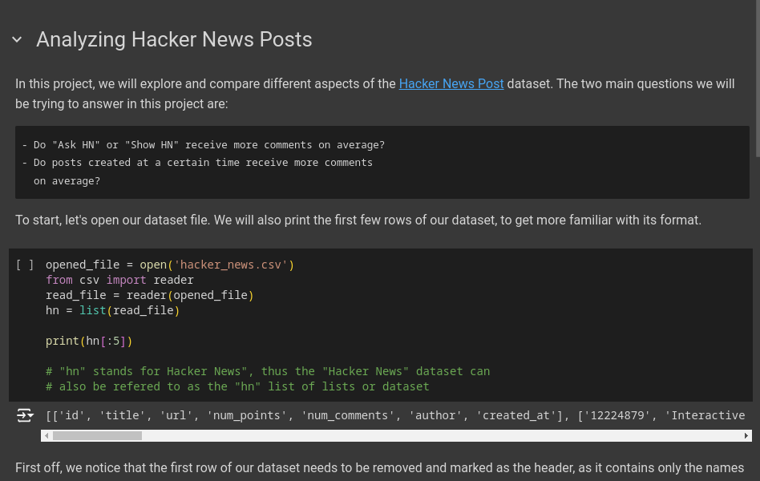

# Analyzing Hacker News Posts
In this project, we will be working with a dataset containing information about roughly 20,000 Hacker News Listings. As we explore the dataset, we will also form some initial analysis of our data. With the results of our analysis, we will address the two questions presented at the beginning of the project:
  - Do "Ask HN" or "Show HN" receive more comments on average?
  - Do posts created at a certain time receive more comments on average?

View this project live on Google Colab [here](https://colab.research.google.com/drive/16C6ijfSvTfi9mliPYq4FqNKXjZ5W2MvX).
